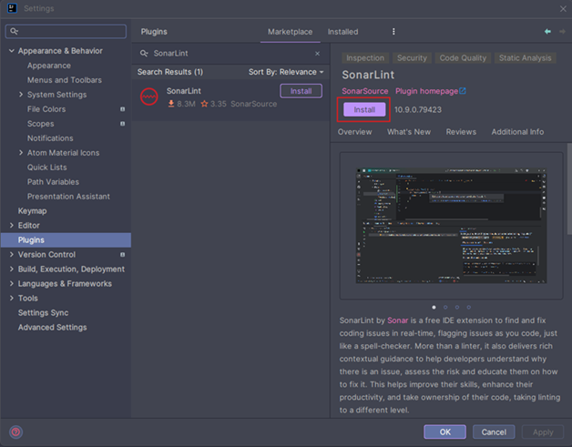

# [Spring Boot SonarQube](https://www.youtube.com/watch?v=H7XvwUMaCno)

- Este tutorial se tomó del canal de youtube de **Un Programador Nace**.
- Como base para el desarrollo de este tutorial utilicé el siguiente proyecto
  [spring-boot-test](https://github.com/magadiflo/spring-boot-test).

---

## Instala Plugin de SonarLint en IntelliJ IDEA

`SonarLint` de `Sonar` es una extensión IDE gratuita para encontrar y solucionar problemas de codificación
`en tiempo real`, marcando los problemas mientras escribes código, como un corrector ortográfico. Más que un `linter`,
también ofrece una guía contextual completa para ayudar a los desarrolladores a comprender por qué hay un problema,
evaluar el riesgo y enseñarles cómo solucionarlo. Esto ayuda a mejorar sus habilidades, aumentar su productividad y
tomar posesión de su código, llevando el `linting` a un nivel diferente.

Cuando se combina con `SonarQube` o `SonarCloud` en modo conectado, `SonarLint` forma una poderosa plataforma de calidad
de código de extremo a extremo para enriquecer el flujo de trabajo de `CI/CD`, asegurando que cualquier edición o
adición de código sea limpia. En el modo conectado, su equipo puede compartir conjuntos de reglas de lenguaje comunes,
configuraciones de análisis de proyectos y más.

`SonarLint` es una poderosa herramienta de código abierto para desarrolladores de todos los niveles de experiencia y
habilidad, que les permite entregar `código limpio`: código apto para el desarrollo y la producción. Una herramienta de
linting esencial para todos los desarrolladores.

Lo primero que haremos será instalar el plugin de `SonarLint` en nuestro `IntelliJ IDEA` para que en tiempo real vaya
escaneando nuestro código y nos diga qué tan buenas prácticas de codificación estamos siguiendo, qué es lo que debemos
corregir, etc.

