# [Spring Boot SonarQube](https://www.youtube.com/watch?v=H7XvwUMaCno)

- Este tutorial se tomó del canal de youtube de **Un Programador Nace**.
- Como base para el desarrollo de este tutorial utilicé el siguiente proyecto
  [spring-boot-test](https://github.com/magadiflo/spring-boot-test).

---

## Instala Plugin de SonarLint en IntelliJ IDEA

`SonarLint` de `Sonar` es una extensión IDE gratuita para encontrar y solucionar problemas de codificación
`en tiempo real`, marcando los problemas mientras escribes código, como un corrector ortográfico. Más que un `linter`,
también ofrece una guía contextual completa para ayudar a los desarrolladores a comprender por qué hay un problema,
evaluar el riesgo y enseñarles cómo solucionarlo. Esto ayuda a mejorar sus habilidades, aumentar su productividad y
tomar posesión de su código, llevando el `linting` a un nivel diferente.

Cuando se combina con `SonarQube` o `SonarCloud` en modo conectado, `SonarLint` forma una poderosa plataforma de calidad
de código de extremo a extremo para enriquecer el flujo de trabajo de `CI/CD`, asegurando que cualquier edición o
adición de código sea limpia. En el modo conectado, su equipo puede compartir conjuntos de reglas de lenguaje comunes,
configuraciones de análisis de proyectos y más.

`SonarLint` es una poderosa herramienta de código abierto para desarrolladores de todos los niveles de experiencia y
habilidad, que les permite entregar `código limpio`: código apto para el desarrollo y la producción. Una herramienta de
linting esencial para todos los desarrolladores.

Lo primero que haremos será instalar el plugin de `SonarLint` en nuestro `IntelliJ IDEA` para que en tiempo real vaya
escaneando nuestro código y nos diga qué tan buenas prácticas de codificación estamos siguiendo, qué es lo que debemos
corregir, etc.

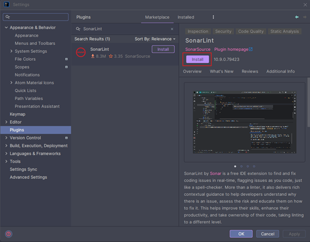

## Funcionamiento de SonarLint

Luego de haber instalado el `Plugin` de `SonarLint`, veamos rápidamente su funcionamiento dentro de nuestro proyecto.

Si abrimos alguna clase de nuestro proyecto, `SonarLint` entrará en acción, por ejemplo, si abrimos el controlador
`AccountController`, inmediatamente `SonarLint` realizará la verificación de nuestro código mostrándonos en la parte
superior derecha el símbolo de un `círculo con raya en medio de color rojo` y un número. Mientras el número sea el
menor posible, es mejor, dado que nos indica qué tantas malas prácticas han detectado.

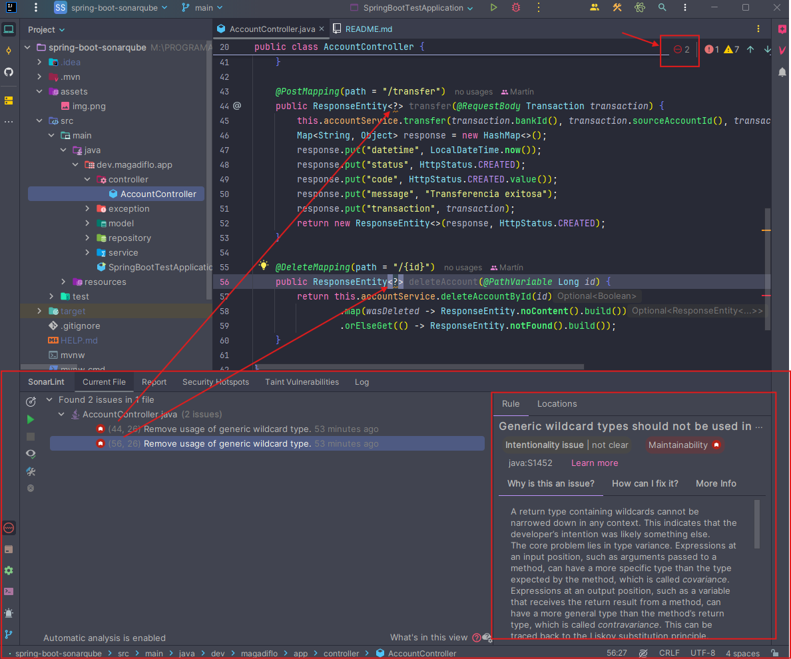

Si damos click en la imagen del círculo rojo, nos aparecerá la consola inferior donde nos indicará dónde se han cometido
las malas prácticas o algún problema de codificación. En nuestro caso, ha detectado dos problemas de intencionalidad,
en nuestro caso la línea `44` y `56` cuya regla que se está violando es
`Los tipos comodín genéricos no deben usarse en tipos de retorno`.

Por el momento lo dejaremos tal cual, ya sabemos para qué sirve el `SonarLint` y ahora continuaremos con el tutorial
donde veremos el uso de `SonarQube` que es el objetivo de este tutorial.

## Configura propiedades de SonarQube en el proyecto

Vamos a agregar las siguientes propiedades de `SonarQube` al archivo `pom.xml`.

````xml

<properties>
    <java.version>21</java.version>

    <!--Sonar Properties-->
    <sonar.projectKey>spring-boot-sonarqube</sonar.projectKey>
    <sonar.projectName>spring-boot-sonarqube</sonar.projectName>
    <sonar.host.url>http://localhost:9000</sonar.host.url>
    <sonar.coverage.jacoco.xmlReportPaths>target/site/jacoco/jacoco.xml</sonar.coverage.jacoco.xmlReportPaths>
    <sonar.coverage.exclusions>src/**/entity/*, src/**/SpringBootTestApplication.java</sonar.coverage.exclusions>
    <!--/Sonar Properties-->
</properties>
````

**DONDE**

- `<sonar.projectKey>` y `<sonar.projectName>`, son usados por el plugin de `SonarQube` (lo agregaremos en el siguiente
  apartado), para identificar el proyecto dentro de `SonarQube`. `projectKey` es el identificador único del proyecto y
  `projectName` es el nombre del proyecto que se mostrará en la interfaz de usuario de `SonarQube`.


- `<sonar.host.url>`, es la URL del servidor de `SonarQube` al que el plugin enviará el análisis. En nuestro caso,
  apunta a un servidor `SonarQube` local en `http://localhost:9000`.


- `<sonar.coverage.jacoco.xmlReportPaths>`, define la ruta del reporte de cobertura de `JaCoCo` que será consumido por
  `SonarQube`. El plugin espera este reporte en la ruta especificada después de ejecutar los tests.


- `<sonar.coverage.exclusions>`, define los archivos o paquetes que deseas excluir del análisis de cobertura de código.
  En nuestro caso, estamos excluyendo las clases bajo `src/**/entity/*` y el archivo `SpringAppApplication.java`. Estas
  serán las mismas exclusiones que colocaremos en la etiqueta `<exclude>` del plugin de `JaCoCo`.

## Agrega plugins de SonarQube y JaCoCo

En nuestro `pom.xml` agregamos los siguientes plugins correspondientes a `SonarQube`, para la revisión de la calidad de
código y a `JaCoCo`, para la cobertura de código. Para mayor información sobre el uso de `JaCoCo` visitar mi
repositorio de [spring-boot-test-jacoco](https://github.com/magadiflo/spring-boot-test-jacoco).

````xml

<plugins>
    <!--SonarQube-->
    <plugin>
        <groupId>org.sonarsource.scanner.maven</groupId>
        <artifactId>sonar-maven-plugin</artifactId>
        <version>4.0.0.4121</version>
    </plugin>
    <!--/SonarQube-->
    <!--JaCoCo-->
    <plugin>
        <groupId>org.jacoco</groupId>
        <artifactId>jacoco-maven-plugin</artifactId>
        <version>0.8.12</version>
        <configuration>
            <excludes>
                <exclude>**/entity/Account.class</exclude>
                <exclude>**/entity/Bank.class</exclude>
                <exclude>**/SpringBootTestApplication.class</exclude>
            </excludes>
        </configuration>
        <executions>
            <execution>
                <goals>
                    <goal>prepare-agent</goal>
                </goals>
            </execution>
            <execution>
                <id>report</id>
                <phase>test</phase>
                <goals>
                    <goal>report</goal>
                </goals>
            </execution>
            <execution>
                <id>check</id>
                <goals>
                    <goal>check</goal>
                </goals>
                <configuration>
                    <rules>
                        <rule>
                            <element>PACKAGE</element>
                            <limits>
                                <limit>
                                    <counter>LINE</counter>
                                    <value>COVEREDRATIO</value>
                                    <minimum>0.85</minimum>
                                </limit>
                            </limits>
                        </rule>
                    </rules>
                </configuration>
            </execution>
        </executions>
    </plugin>
    <!--/JaCoCo-->
</plugins>
````

Notar que en el plugin de `JaCoCo` estoy excluyendo tres clases: dos entidades y la clase principal de la aplicación.
Las entidades por sí mismas no contienen lógica, solo contiene atributos con los que se mapean a las columnas de
las tablas en la base de datos.

Con respecto a la clase principal `SpringBootTestApplication`, también lo excluímos, dado que no tenemos lógica dentro,
pero si la tuviéramos, sí sería necesario crearle sus test unitario y no excluirlo de la cobertura.

**NOTA**

> En nuestro caso, la entidad `Account` sí contiene cierta lógica en el método `debit()`, incluso está lanzando
> una excepción. Definir este método con esa lógica dentro de la entidad, estaría mal desde mi punto de vista.
> La lógica debería haberlo colocado en otra clase, pero bueno, así desde un inicio lo diseño el tutor `Andrés Guzmán`
> que fue de donde se tomó el curso original de este proyecto base (`spring-boot-test`). Entonces, en mi caso, también
> lo voy a excluir para tratarlo como una entidad que no debe añadirse para la evaluación de la cobertura de código.

## [Iniciar el contenedor de SonarQube mediante Docker Compose](https://docs.sonarsource.com/sonarqube/latest/setup-and-upgrade/install-the-server/installing-sonarqube-from-docker/)

Vamos a crear el archivo `compose.yml` donde definiremos los siguientes servicios. El primero será para la creación
del contenedor de `SonarQube` y el segundo será para crear una base de datos de `PostgreSQL` que usará el contenedor
de `SonarQube`.

Esta configuración de `docker compose` lo obtuve de la página oficial de `SonarQube`, del apartado
[Starting the container by using Docker compose](https://docs.sonarsource.com/sonarqube/latest/setup-and-upgrade/install-the-server/installing-sonarqube-from-docker/),
aunque luego agregué algunas otras configuraciones adicionales como el nombre de los contenedores, nombre de los
volúmenes, de la red y se definió una base de datos llamada `db_sonarqube`.

````yml
services:
  sonarqube:
    image: sonarqube:lts-community
    container_name: c-sonarqube
    depends_on:
      - db-sonarqube
    environment:
      SONAR_JDBC_URL: jdbc:postgresql://db-sonarqube:5432/db_sonarqube
      SONAR_JDBC_USERNAME: sonar
      SONAR_JDBC_PASSWORD: sonar
    volumes:
      - sonarqube_data:/opt/sonarqube/data
      - sonarqube_extensions:/opt/sonarqube/extensions
      - sonarqube_logs:/opt/sonarqube/logs
    ports:
      - '9000:9000'
    networks:
      - sonarqube-net

  db-sonarqube:
    image: postgres:15.2-alpine
    container_name: c-db-sonarqube
    environment:
      POSTGRES_DB: db_sonarqube
      POSTGRES_USER: sonar
      POSTGRES_PASSWORD: sonar
    volumes:
      - postgresql:/var/lib/postgresql
      - postgresql_data:/var/lib/postgresql/data
    networks:
      - sonarqube-net

volumes:
  sonarqube_data:
    name: sonarqube_data
  sonarqube_extensions:
    name: sonarqube_extensions
  sonarqube_logs:
    name: sonarqube_logs
  postgresql:
    name: postgresql
  postgresql_data:
    name: postgresql_data

networks:
  sonarqube-net:
    name: sonarqube-net
````

La creación de los siguientes volúmenes para el contenedor de `SonarQube` ayuda a evitar la pérdida de información al
actualizar a una nueva versión o a una edición superior:

- `sonarqube_data`: contiene archivos de datos, como índices de Elasticsearch
- `sonarqube_logs`: contiene registros de SonarQube sobre el acceso, el proceso web, el proceso CE y Elasticsearch
- `sonarqube_extensions`: contendrá todos los plugins que instale y el controlador JDBC de Oracle, si es necesario.

**NOTA**
> Ya se proporcionan los controladores para las bases de datos compatibles `(excepto Oracle)`. Si utiliza una base de
> datos `Oracle`, debe agregar el controlador `JDBC` al volumen `sonar_extensions`.

Con respecto al contenedor de postgres, hemos definido dos volúmenes. Aquí se muestra una explicación de cada uno.

1. `postgresql:/var/lib/postgresql`: Este volumen se utiliza para almacenar los archivos de configuración y otros datos
   necesarios para la operación de `PostgreSQL`. Es útil para mantener la configuración persistente entre reinicios del
   contenedor.
2. `postgresql_data:/var/lib/postgresql/data`: Este volumen es específico para los datos de la base de datos. Al separar
   los datos de la base de datos de los archivos de configuración, puedes gestionar mejor las copias de seguridad y la
   recuperación de datos.

Ahora que tenemos los dos servicios bien configurados, procedemos a levantar los contenedores ejecutando el siguiente
comando.

````bash
$ docker compose up -d

[+] Running 8/8                          
 ✔ Network sonarqube-net          Created
 ✔ Volume "sonarqube_extensions"  Created
 ✔ Volume "sonarqube_logs"        Created
 ✔ Volume "postgresql"            Created
 ✔ Volume "postgresql_data"       Created
 ✔ Volume "sonarqube_data"        Created
 ✔ Container c-db-sonarqube       Started
 ✔ Container c-sonarqube          Started
````

Listamos y verificamos que los dos contenedores se han levantado exitosamente. Es importante notar que el contenedor de
la base de datos de postgres para sonarqube solo tiene definido su puerto interno, no el externo. Por lo que, el
contenedor de `c-sonarqube` se comunica con el contenedor `c-db-sonarqube` a través del nombre del servicio
`db-sonarqube`.

````bash
$ ocker container ls -a
CONTAINER ID   IMAGE                     COMMAND                  CREATED          STATUS                     PORTS                    NAMES
7b809603ab28   sonarqube:lts-community   "/opt/sonarqube/dock…"   10 seconds ago   Up 9 seconds               0.0.0.0:9000->9000/tcp   c-sonarqube
657a4a6059e1   postgres:15.2-alpine      "docker-entrypoint.s…"   10 seconds ago   Up 9 seconds               5432/tcp                 c-db-sonarqube
````

Si ingresamos dentro del contenedor de la base de datos de postgres, veremos que se ha creado correctamente la base
de datos y también las tablas.

````bash
$ docker container exec -it c-db-sonarqube /bin/sh
/ # psql -U sonar -d db_sonarqube
psql (15.2)
Type "help" for help.

db_sonarqube=# \l
                                              List of databases
     Name     | Owner | Encoding |  Collate   |   Ctype    | ICU Locale | Locale Provider | Access privileges
--------------+-------+----------+------------+------------+------------+-----------------+-------------------
 db_sonarqube | sonar | UTF8     | en_US.utf8 | en_US.utf8 |            | libc            |
 postgres     | sonar | UTF8     | en_US.utf8 | en_US.utf8 |            | libc            |
 template0    | sonar | UTF8     | en_US.utf8 | en_US.utf8 |            | libc            | =c/sonar         +
              |       |          |            |            |            |                 | sonar=CTc/sonar
 template1    | sonar | UTF8     | en_US.utf8 | en_US.utf8 |            | libc            | =c/sonar         +
              |       |          |            |            |            |                 | sonar=CTc/sonar
(4 rows)

db_sonarqube=# \dt
                 List of relations
 Schema |           Name            | Type  | Owner
--------+---------------------------+-------+-------
 public | active_rule_parameters    | table | sonar
 public | active_rules              | table | sonar
 ...
````

Luego de haber verificado que los contenedores están corriendo, vamos a abrir el navegador y colocar la siguiente `url`
para acceder a `SonarQube`: `http://localhost:9000`. Recordar que el puerto `9000` fue el que definimos a `SonarQube`
en el archivo `compose.yml`.

Al acceder a `SonarQube` por primera vez, nos pedirá que iniciemos sesión. El usuario será `admin` y la contraseña será
`admin`. Estas credenciales son las que vienen por defecto en `SonarQube`.

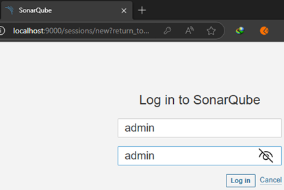

En la siguiente pantalla creamos una nueva contraseña a partir de la contraseña anterior (`admin`). La nueva contraseña
que le establecí fue `sonar`.

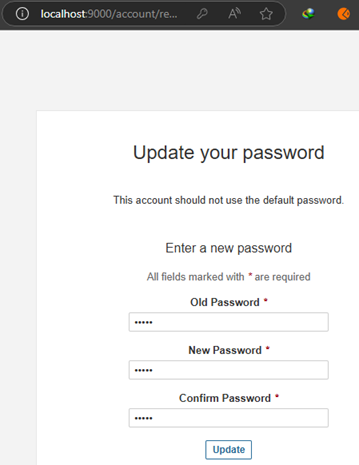

Al dar en el botón `Update` seremos redireccionados a la pantalla principal de `SonarQube`. Es en esta pantalla donde
empezaremos a trabajar con `SonarQube`.

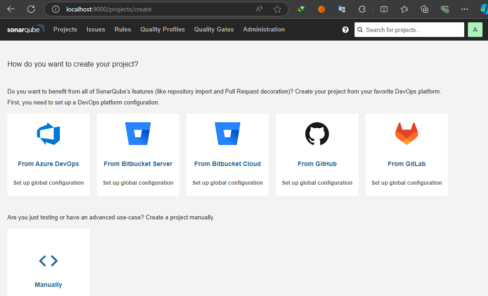

## Generando Token de Seguridad para acceder desde Spring Boot a SonarQube

Nos vamos al apartado de `My Account`.

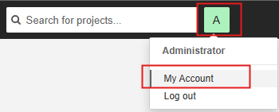

En la pestaña `Security` configuramos ciertos parámetros para generar un token.

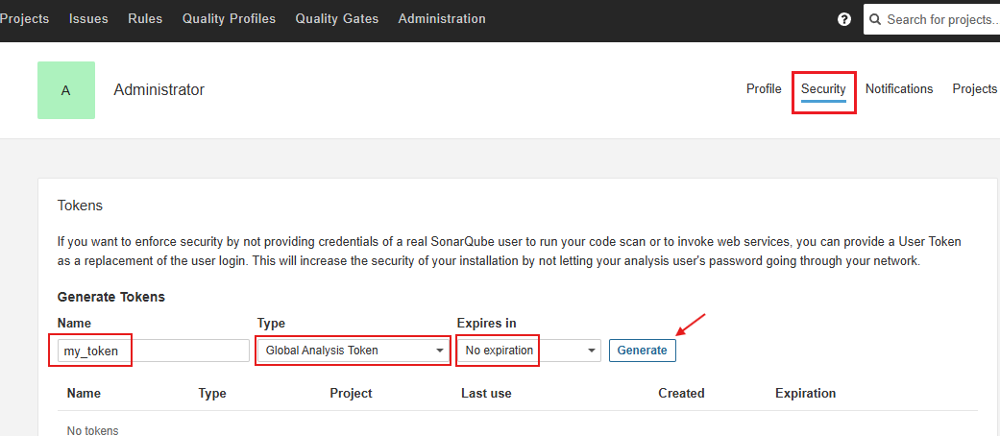

Debemos copiar y guardar bien el token, ya que luego no se mostrará.

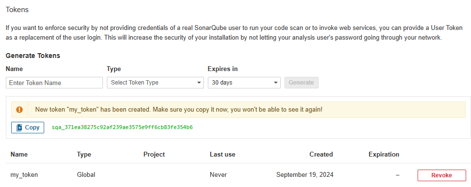

## Genera el jar ejecutando los test de Spring Boot

Con el siguiente comando nosotros construimos el `jar` de nuestro proyecto y al mismo tiempo se ejecutan los test que
tenemos en la aplicación.

````bash
$ mvn clean package
````

Al finalizar, vemos que todos los test pasan exitosamente y que nuestro `jar` se ha construido sin problemas.

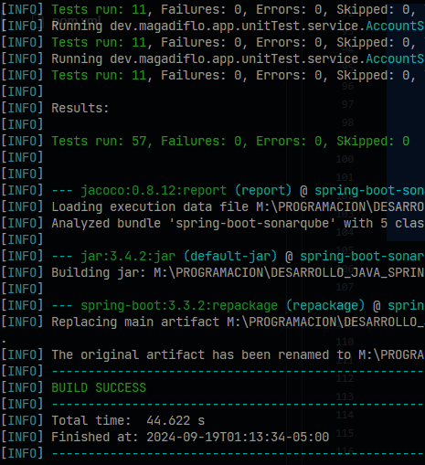

Con el siguiente comando, verificamos si nuestros paquetes están cumpliendo con la cobertura mínima establecida
en `jacoco` dentro del `pom.xml`. Entonces, para verificar la cobertura ejecutamos el siguiente comando:

````bash
$ mvn clean verify
````

Finalizada la ejecución, vemos que hemos pasado exitosamente la cobertura mínima establecida.

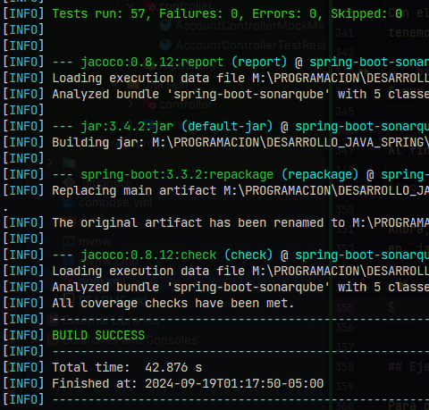

## Ejecuta reporte de SonarQube

Para generar el reporte de `SonarQube` ejecutamos el siguiente comando. Notar que aquí estamos haciendo uso del
token que generamos en un apartado superior.

`verify`, esta fase de `Maven` se encarga de ejecutar cualquier verificación necesaria en el proyecto
para asegurar que está listo para ser empaquetado. Esto incluye la ejecución de `tests unitarios` y de `integración`.
Si tienes configurado `Jacoco`, también generará el `reporte de cobertura de código` en esta fase.

`sonar:sonar`, este es el objetivo del plugin de `SonarQube` para analizar el código fuente. `SonarQube` realiza un
análisis estático del código para encontrar bugs, vulnerabilidades y otros problemas de calidad del código.

`-D sonar.login`, esta es una opción que pasa un parámetro al plugin de `SonarQube`. En este caso, `sonar.login` es la
clave de acceso o token que se utiliza para autenticar la conexión con el servidor de `SonarQube`. Es decir, este
token permite que el análisis pueda subirse al servidor y ser registrado.

````bash
$ mvn clean verify sonar:sonar -D sonar.login=sqa_371ea38275c92af239ae3575e9ff6cb83fe354b6
````

**NOTA**

> En el tutorial original de `Un Programador Nace` no usa `sonar.login` sino más bien, `sonar.token`, esto posiblemente
> se deba a la versión de `SonarQube` que está usando.

Al finalizar la ejecución del comando anterior, vemos que tanto la verificación como la

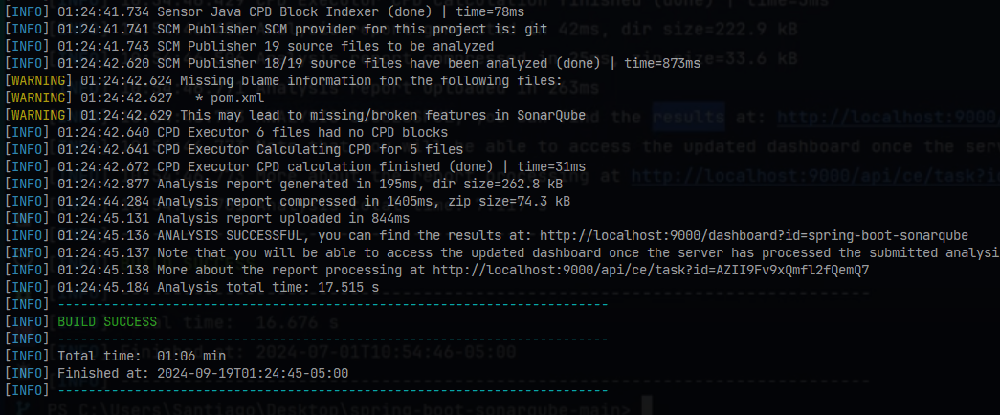

Ahora, si nos dirigimos al servidor de `SonarQube` veremos que los resultados ya se han subido.

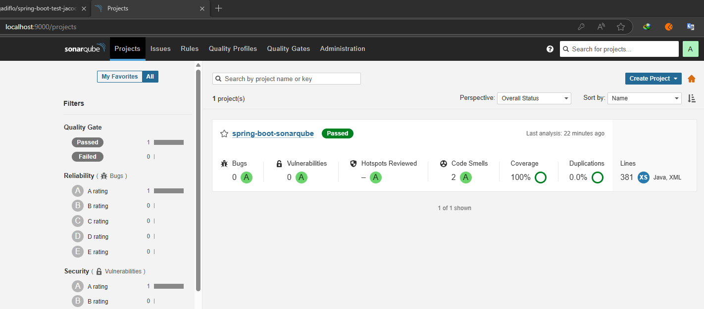

Si ingresamos al nombre que le definimos al proyecto `spring-boot-sonarqube` veremos que está todo en verde. Todo ha
pasado exitosamente.

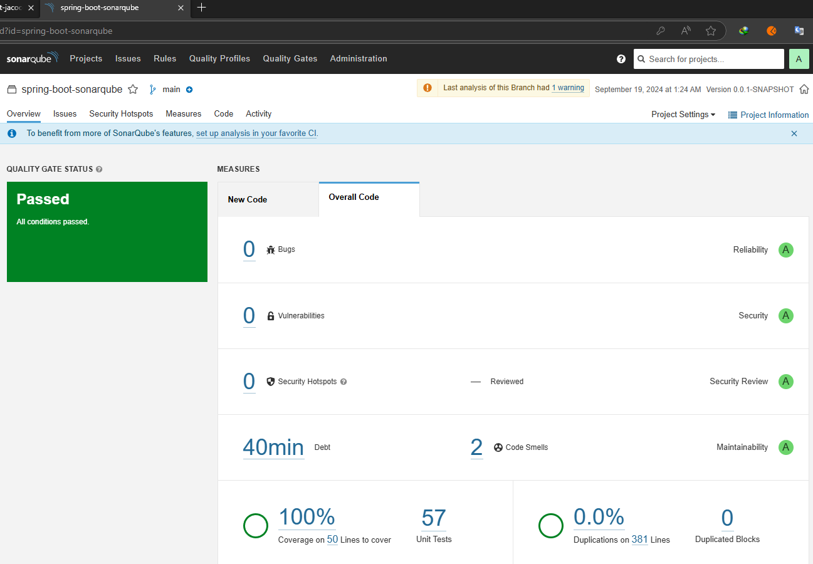
